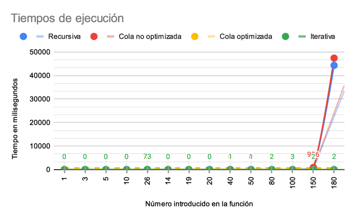

# Funciones F55
### Pregunta 4
Dada la familia de funciones:

Se crearon para alpha=5 y beta=5 varias versiones de esta función: Recursiva, recursiva de cola e iterativa.
La versión recursiva es una traducción del lenguaje matemático a Kotlin, por lo que no se optimizó de ningun manera. Se crearon dos funciones recursivas de cola, una optimizada y la otra no, si bien la versión no optimizada de cola es mucho más lenta que la versión optimizada, puede calcular mucho más rápido que la versión recursiva. Además se creó una versión iterativa basada en la versión de cola.

## Resultados obtenidos

### Versión Recursiva

### Versión Recursiva de cola no optimizada

### Versión Recursiva de cola optimizada

### Versión iterativa

## Conclusiones

Con los resultados obtenidos en las pruebas realizadas, podemos llegar a la conclusión que la versión más eficiente de este programa es la versión iterativa y la de cola optimizada, ya que hacen uso de un diccionario en el que alojan los valores y pueden correr el programa de manera sencilla y muy rápida, existiendo una diferencia muy grande con el comportamiento con el resto de las funciones.

Por esto, aunque la función recursiva puede calcular valores pequeños, su comportamiento es exponencial, por lo que se tarda mucho tiempo para grandes valores, los que pueden manejarse muy bien con funciones como la iterativa o la recursión de cola optimizada. 

Además para ser una recursión, la recursión de cola optimizada es capaz de manejar una gran cantidad de valores, pero aún así depende del tamaño del stack y es por esto que la función iterativa puede realizar el cálculo de números más grandes.

Aunque la función iterativa mostró un límite para números a partir de 400.000, es posible aumentar el heap space en Kotlin y lograr hacer cálculos con números mayores, por lo que esta es la función más eficiente de todas las programadas para el cálculo de F 5,5.
